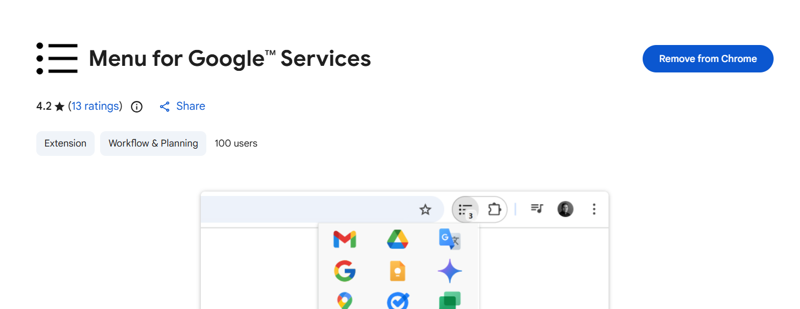
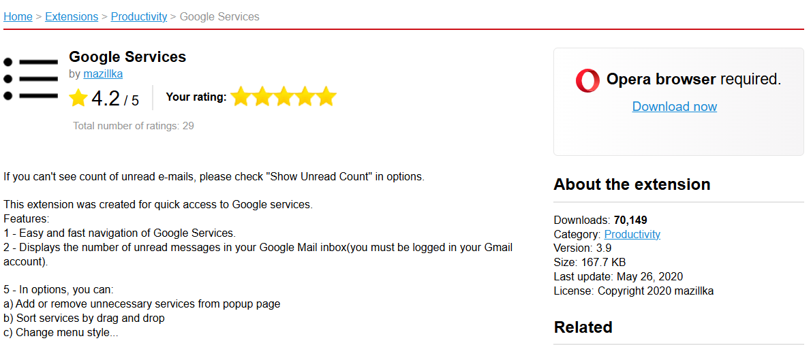
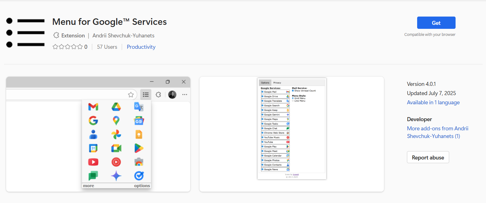

# Menu-For-Google-Services-Ext

GoogleServicesExt is a browser extension that provides a convenient, customizable menu for quick access to popular Google services such as Gmail, Drive, Calendar, and more. 
With this extension, users can easily navigate between Google products from a single menu, improving productivity and workflow efficiency.

## Features

- Quick access to a wide range of Google services from your browser toolbar
- Customizable menu to add, remove, or reorder services
- Lightweight and easy to use
- Supports Chrome, Opera and Edge browsers

## Installation

- **Chrome:** [Install from Chrome Web Store](https://chrome.google.com/webstore/detail/iaflbhdheobajkkpiahidpjpmgeijhdo)
- **Opera:** [Install from Opera Add-ons](https://addons.opera.com/ru/extensions/details/google-services)
- **Edge:** [Install from Edge Add-ons](https://microsoftedge.microsoft.com/addons/detail/menu-for-google%E2%84%A2-services/miaoijfohfgeniidndoinmjabjjjejon)

## Stats DEC 1 2025

- **Chrome:**

- **Opera:**
 

- **Edge:**

## License

This project is licensed under the MIT License.
